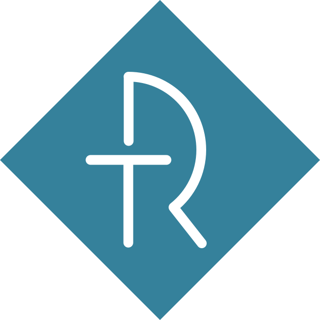

# RailTech — Пошаговый план устранения недостатков

**Дата:** 2026-03-15
**Основание:** AUDIT.md

**Принято:**
- Все замечания Team Lead Web Developer
- Все замечания SEO Specialist
- Все замечания UX/UI Designer (кроме скрытых партнёров — список ещё редактируется)
- Все замечания Content Manager

**Отложено:** замечания Head of Marketing

---

## Фаза 1 — Критические баги и сломанный функционал
> Цель: сделать сайт корректно работающим на продакшене

### Шаг 1.1 — Исправить deploy.yml (исключение JSON-файлов)
**Файл:** `.github/workflows/deploy.yml`
**Проблема:** регулярное выражение `.*\.json$` исключает все JSON-файлы из деплоя, включая `locales/*.json`. Переводы никогда не попадают на сервер.
**Решение:** изменить regex, чтобы исключать только скрытые файлы, но не JSON:
```yaml
# Было:
gsutil -m rsync -r -x '(^|/)\.|.*\.json$' . gs://${{ secrets.GCS_BUCKET }}

# Стало:
gsutil -m rsync -r -x '(^|/)\.' . gs://${{ secrets.GCS_BUCKET }}
```
**Дополнительно:** обновить `actions/checkout@v3` → `@v4`.

### Шаг 1.2 — Заменить плейсхолдер "Index" в адресе
**Файлы:** `index.html`, `js/i18n.js` (INLINE-переводы), `locales/ru.json`, `locales/en.json`, `locales/uz.json`
**Проблема:** футер отображает "г. Ташкент, **Index**, Офис B2-2097" — "Index" не был заменён на реальный почтовый индекс.
**Решение:** запросить у заказчика реальный почтовый индекс и заменить во всех вхождениях ключа `footer_address`. Временно можно убрать слово "Index" если индекс неизвестен.
**Затронутые вхождения:**
- `index.html` — HTML-текст в footer
- `i18n.js` строки: `footer_address:"г. Ташкент, Index,<br>Офис B2-2097"` (ru), `"Tashkent, Index,<br>Office B2-2097"` (en), `"Toshkent sh., Index,<br>Ofis B2-2097"` (uz)
- `locales/ru.json`: `"footer_address"`
- `locales/en.json`: `"footer_address"`
- `locales/uz.json`: `"footer_address"`

### Шаг 1.3 — Исправить битую ссылку cookie-баннера
**Файл:** `js/cookie-consent.js`
**Проблема:** ссылка `privacy.html` в cookie-баннере ведёт в корень, а реальный файл лежит в `pages/privacy.html`. На корневой странице ссылка сломана.
**Решение:** использовать абсолютный путь:
```js
// Было:
<a href="privacy.html">${c('learn')}</a>

// Стало:
<a href="/pages/privacy.html">${c('learn')}</a>
```

### Шаг 1.4 — Создать og-image.png
**Проблема:** `<meta property="og:image">` ссылается на `og-image.png`, который не существует. При шаринге в соцсетях/мессенджерах нет превью.
**Решение:** создать изображение 1200x630px с логотипом RailTech, слоганом и фирменными цветами. Разместить в корне: `/og-image.png`.
**Формат:** PNG, оптимизированный, < 300 KB.

### Шаг 1.5 — Синхронизировать HTML-текст и JSON-переводы
**Файлы:** `index.html`, `locales/ru.json`, `js/i18n.js`
**Проблема:** HTML-фоллбек текст (виден до загрузки i18n) отличается от JSON-переводов. Пример: FAQ-ответы в HTML короче, чем в JSON. Это создаёт «прыжок» контента при загрузке.
**Решение:** скопировать тексты из `locales/ru.json` в соответствующие HTML-элементы `index.html`, чтобы fallback-текст совпадал с финальным. Затронутые секции:
- FAQ ответы (faq_1_a — faq_5_a)
- form_desc
- faq_desc
- srv_1_desc — srv_4_desc
- platform_desc
- Любые другие элементы с `data-i18n` где текст расходится

---

## Фаза 2 — Архитектура и Build Pipeline
> Цель: заменить Tailwind CDN на build-процесс, добавить минификацию

### Шаг 2.1 — Инициализировать npm-проект и установить зависимости
```bash
npm init -y
npm install -D tailwindcss postcss autoprefixer cssnano
npx tailwindcss init -p
```
**Создать файлы:**
- `tailwind.config.js` — перенести конфигурацию из inline `<script>` в index.html (keyframes, colors, fontFamily)
- `postcss.config.js` — подключить tailwindcss, autoprefixer, cssnano
- `src/input.css` — содержит `@tailwind base; @tailwind components; @tailwind utilities;` + все кастомные стили из `<style>` тегов

### Шаг 2.2 — Собрать CSS и заменить CDN
- Запустить `npx tailwindcss -i src/input.css -o dist/output.css --minify`
- Добавить в `package.json` скрипт: `"build:css": "tailwindcss -i src/input.css -o dist/output.css --minify"`
- Добавить скрипт: `"watch:css": "tailwindcss -i src/input.css -o dist/output.css --watch"`
- Во всех HTML-файлах:
  - Удалить `<script src="https://cdn.tailwindcss.com"></script>`
  - Удалить inline `<script>tailwind.config = {...}</script>`
  - Удалить дублирующиеся `<style>` блоки
  - Добавить `<link rel="stylesheet" href="/dist/output.css">`

### Шаг 2.3 — Минификация JS (опционально, но желательно)
- Установить `terser`: `npm install -D terser`
- Добавить скрипт: `"build:js": "terser js/main.js -o dist/main.min.js -c -m && terser js/i18n.js -o dist/i18n.min.js -c -m && terser js/cookie-consent.js -o dist/cookie-consent.min.js -c -m"`
- Обновить ссылки в HTML на минифицированные файлы

### Шаг 2.4 — Обновить deploy.yml
- Добавить шаг `npm ci && npm run build` перед загрузкой на GCS
- Добавить `Cache-Control` заголовки при загрузке:
```yaml
gsutil -m -h "Cache-Control:public,max-age=31536000,immutable" rsync -r dist/ gs://$BUCKET/dist/
gsutil -m -h "Cache-Control:public,max-age=3600" rsync -r -x '(^|/)\.' . gs://$BUCKET
```

### Шаг 2.5 — Удалить мусорные файлы
**Удалить:**
- `pages/home.html` (пустой)
- `pages/news.html` (пустой)
- `pages/products.html` (пустой)
- `pages/404.html` (пустой, дубль корневого `404.html`)
- `CNAME` (не нужен для GCS-деплоя)

### Шаг 2.6 — Добавить `.gitignore` записи
```
node_modules/
dist/
.DS_Store
```

---

## Фаза 3 — Производительность
> Цель: улучшить LCP, FCP, снизить потребление CPU

### Шаг 3.1 — Добавить `defer` на все скрипты
**Файлы:** `index.html`, `404.html`, `pages/privacy.html`, `pages/terms.html`, `pages/coming-soon.html`
**Решение:** заменить:
```html
<script src="js/i18n.js"></script>
<script src="js/main.js"></script>
<script src="js/cookie-consent.js"></script>
```
на:
```html
<script src="js/i18n.js" defer></script>
<script src="js/main.js" defer></script>
<script src="js/cookie-consent.js" defer></script>
```

### Шаг 3.2 — Пауза Canvas-анимации вне viewport
**Файл:** `js/main.js`, функция `initHeroCanvas()`
**Проблема:** `requestAnimationFrame` крутится бесконечно даже при скролле вниз.
**Решение:** добавить Intersection Observer + Page Visibility API:
```js
// После определения canvas и перед draw():
let canvasVisible = true;

const visObs = new IntersectionObserver(([entry]) => {
    canvasVisible = entry.isIntersecting;
    if (canvasVisible && !raf) raf = requestAnimationFrame(draw);
}, { threshold: 0.05 });
visObs.observe(canvas);

document.addEventListener('visibilitychange', () => {
    if (document.hidden) { cancelAnimationFrame(raf); raf = null; }
    else if (canvasVisible) raf = requestAnimationFrame(draw);
});

// В конце функции draw():
// Заменить безусловный `raf = requestAnimationFrame(draw);`
// на: `if (canvasVisible) raf = requestAnimationFrame(draw);`
```

### Шаг 3.3 — Self-host шрифт Inter
**Решение:**
1. Скачать Inter из Google Fonts (woff2, веса 400, 500, 600, 700, 800)
2. Разместить в `fonts/inter/`
3. Добавить `@font-face` в `src/input.css`
4. Удалить `<link>` на Google Fonts из всех HTML-файлов
5. Удалить `<link rel="preconnect" href="https://fonts.googleapis.com">` и `fonts.gstatic.com`

### Шаг 3.4 — Добавить resource hints
**Файл:** `index.html` `<head>`
```html
<link rel="preconnect" href="https://api.web3forms.com">
<link rel="dns-prefetch" href="https://api.web3forms.com">
```

### Шаг 3.5 — Оптимизировать SVG
- Прогнать все SVG через SVGO: `npx svgo -f images/ -r`
- Особенно `loco.svg` (50 KB) и партнёрские логотипы

---

## Фаза 4 — Качество кода и безопасность
> Цель: исправить XSS-паттерны, унифицировать стиль, добавить защиту

### Шаг 4.1 — Исправить tooltip XSS-паттерн
**Файл:** `js/main.js`, героический canvas, tooltip
**Проблема:** `tooltip.innerHTML = '<b style="color:'+hn.color+'">'+hn.label+'</b>...'`
**Решение:** использовать DOM API:
```js
tooltip.textContent = '';
const b = document.createElement('b');
b.style.color = hn.color;
b.textContent = hn.label;
const br = document.createElement('br');
const span = document.createElement('span');
span.style.opacity = '0.7';
span.textContent = hn.desc;
tooltip.append(b, br, span);
```

### Шаг 4.2 — Убрать `to` email из HTML-формы
**Файл:** `index.html`
**Проблема:** `<input type="hidden" name="to" value="zulkaynarov@gmail.com">` — email публично виден и может быть подменён.
**Решение:** удалить эту строку. Настроить получателя в дашборде Web3Forms (привязан к access_key).

### Шаг 4.3 — Унифицировать `var` → `const`/`let` в hero canvas
**Файл:** `js/main.js`, функция `initHeroCanvas()`
**Проблема:** весь canvas-код на `var`, остальной файл на `const`/`let`.
**Решение:** заменить все `var` на `const`/`let` по контексту использования.

### Шаг 4.4 — Добавить error boundary на инициализацию
**Файл:** `js/main.js`, функция `init()`
**Решение:** обернуть каждый init-вызов в try-catch:
```js
function init() {
    const modules = [
        initStickyNav, initMobileMenu, initScrollReveal,
        initCounters, initPlatformShowcase, initFAQ,
        initContactForm, initMarquee, initHeroCanvas, initHeroTypewriter
    ];
    modules.forEach(fn => {
        try { fn(); } catch (err) { console.warn(`[RailTech] ${fn.name} failed:`, err); }
    });
}
```

### Шаг 4.5 — Исправить нумерацию секций в комментариях
**Файл:** `js/main.js`
**Проблема:** две секции под номером "6" (FAQ Accordion и Sticky Nav).
**Решение:** перенумеровать: FAQ = 6, Sticky Nav = 7, Contact Form = 8, Partners Marquee = 9.

### Шаг 4.6 — Удалить дублирование переводов
**Файлы:** `js/i18n.js`
**Проблема:** INLINE-объект (~180 строк) дублирует `locales/*.json`.
**Решение:**
- **Вариант A (простой):** оставить INLINE как сокращённый fallback (только ключевые навигационные строки ~20 ключей), удалить полный контент.
- **Вариант B (build-time):** при build'е автоматически генерировать INLINE из JSON файлов через скрипт.
- Рекомендация: **Вариант A** — оставить в INLINE только nav_*, btn_*, footer_copy, err_* (то что видно сразу при загрузке). Удалить FAQ, services, platform и т.д.

### Шаг 4.7 — Добавить CSP meta-тег
**Файл:** `index.html` `<head>`
```html
<meta http-equiv="Content-Security-Policy"
      content="default-src 'self';
               script-src 'self' 'unsafe-inline';
               style-src 'self' 'unsafe-inline';
               font-src 'self';
               img-src 'self' data:;
               connect-src 'self' https://api.web3forms.com;
               frame-src 'none';">
```
**Примечание:** после перехода с CDN на build CSS, можно будет убрать `'unsafe-inline'` из `style-src`. Inline-скрипты (JSON-LD) потребуют nonce или hash.

---

## Фаза 5 — Accessibility (a11y)
> Цель: соответствие WCAG 2.1 AA

### Шаг 5.1 — Добавить "Skip to content"
**Файл:** `index.html` (сразу после `<body>`)
```html
<a href="#about" class="sr-only focus:not-sr-only focus:fixed focus:top-4 focus:left-4 focus:z-[200] focus:bg-blue-600 focus:text-white focus:px-4 focus:py-2 focus:rounded-lg">
    Перейти к содержимому
</a>
```
**Перевести:** добавить `data-i18n="skip_to_content"` + ключи в JSON/INLINE.

### Шаг 5.2 — Исправить ARIA для Platform Tabs
**Файл:** `index.html`, секция Platform Showcase
**Решение:**
- Контейнер табов: добавить `id="platformTablist"` к div с `role="tablist"`
- Каждому `<button role="tab">`: добавить `id="platform-tab-N"`, `aria-controls="platform-panel-N"`
- Каждому `.platform-slide[role="tabpanel"]`: добавить `id="platform-panel-N"`, `aria-labelledby="platform-tab-N"`

### Шаг 5.3 — Добавить aria-label на Canvas
**Файл:** `index.html`
```html
<canvas id="heroCanvas" aria-label="Интерактивная визуализация цепочки поставок RailTech" role="img" ...>
```
Добавить скрытый текстовый аналог для скринридеров:
```html
<div class="sr-only">
    RailTech управляет полным циклом поставки: производство, импорт, таможня, логистика, документы, сертификация, склад, аналитика, поддержка.
</div>
```

### Шаг 5.4 — Переводимые aria-labels
**Файлы:** `index.html`, `locales/*.json`, `js/i18n.js`
**Проблема:** aria-labels захардкожены на русском.
**Решение:** добавить `data-i18n-aria` атрибут или обновить i18n.js чтобы обрабатывать `aria-label`:
- Добавить в `applyTranslations()`:
```js
document.querySelectorAll('[data-i18n-aria]').forEach(el => {
    const val = t(el.getAttribute('data-i18n-aria'));
    if (val !== el.getAttribute('data-i18n-aria')) el.setAttribute('aria-label', val);
});
```
- Добавить ключи: `aria_open_menu`, `aria_close_menu`, `aria_language`, `aria_canvas`
- Заменить `aria-label="Открыть меню"` → `data-i18n-aria="aria_open_menu"` и т.д.

### Шаг 5.5 — Переделать FAQ на корректную ARIA-структуру
**Файл:** `index.html`
**Решение:** заменить `role="list"` / `role="listitem"` на правильный паттерн аккордеона:
- Убрать `role="list"` с контейнера
- Убрать `role="listitem"` с элементов
- Кнопкам добавить `aria-controls="faq-body-N"`
- Телам ответов добавить `id="faq-body-N"`, `role="region"`, `aria-labelledby="faq-btn-N"`

### Шаг 5.6 — Улучшить валидацию формы
**Файл:** `index.html`, `js/main.js`
**Решение:**
- Добавить `aria-required="true"` на обязательные поля
- В `initContactForm()` добавить обработку невалидных полей:
  - Подсветка красной рамкой (`border-red-500`)
  - Добавление `aria-invalid="true"` + `aria-describedby` с текстом ошибки
  - Показ сообщений об ошибках под каждым полем
- Убрать `novalidate` или оставить, но добавить кастомную валидацию с корректными ARIA-атрибутами

### Шаг 5.7 — Улучшить focus-стили
**Файл:** `src/input.css` (или `<style>` пока без build)
```css
:focus-visible {
    outline: 2px solid #3b82f6;
    outline-offset: 2px;
}
```
Заменить все `focus:ring-blue-500/30` → `focus-visible:ring-blue-500` (без прозрачности).

---

## Фаза 6 — SEO
> Цель: улучшить видимость в поисковиках, подготовить к индексации

### Шаг 6.1 — Обновить sitemap.xml
**Файл:** `sitemap.xml`
- Обновить `<lastmod>` на актуальную дату: `2026-03-15`
- Рассмотреть автоматическое обновление при деплое (можно через `sed` в deploy.yml):
```yaml
- name: Update sitemap date
  run: sed -i "s|<lastmod>.*</lastmod>|<lastmod>$(date +%Y-%m-%d)</lastmod>|g" sitemap.xml
```

### Шаг 6.2 — Добавить FAQPage schema
**Файл:** `index.html`, в `<script type="application/ld+json">`
**Решение:** добавить в `@graph`:
```json
{
    "@type": "FAQPage",
    "@id": "https://railtech.uz/#faq",
    "mainEntity": [
        {
            "@type": "Question",
            "name": "Как оформить заявку на коммерческое предложение?",
            "acceptedAnswer": {
                "@type": "Answer",
                "text": "Зарегистрируйтесь в личном кабинете, пройдите быструю верификацию компании (KYC), выберите нужные позиции в каталоге и нажмите «Запросить КП». Менеджер сформирует предложение и пришлёт его в кабинет."
            }
        }
        // ... остальные 4 вопроса
    ]
}
```

### Шаг 6.3 — Добавить BreadcrumbList schema для подстраниц
**Файлы:** `pages/privacy.html`, `pages/terms.html`
```json
{
    "@type": "BreadcrumbList",
    "itemListElement": [
        { "@type": "ListItem", "position": 1, "name": "Главная", "item": "https://railtech.uz/" },
        { "@type": "ListItem", "position": 2, "name": "Политика конфиденциальности" }
    ]
}
```

### Шаг 6.4 — Добавить хлебные крошки в UI подстраниц
**Файлы:** `pages/privacy.html`, `pages/terms.html`, `pages/coming-soon.html`
**Решение:** добавить навигационный элемент:
```html
<nav aria-label="Breadcrumb" class="max-w-4xl mx-auto px-5 py-4 text-sm text-slate-500">
    <a href="/" class="hover:text-blue-600">Главная</a>
    <span class="mx-2">/</span>
    <span class="text-slate-300">Политика конфиденциальности</span>
</nav>
```

### Шаг 6.5 — Сделать `<title>` и `<meta description>` переводимыми
**Файл:** `js/i18n.js`, функция `applyTranslations()`
**Решение:** добавить обработку `<title>` и `<meta name="description">`:
```js
// В applyTranslations():
const titleKey = document.querySelector('title[data-i18n]');
if (titleKey) document.title = t(titleKey.getAttribute('data-i18n'));

const metaDesc = document.querySelector('meta[name="description"][data-i18n]');
if (metaDesc) metaDesc.setAttribute('content', t(metaDesc.getAttribute('data-i18n')));
```
Добавить ключи: `page_title`, `page_description` в JSON-файлы.
В HTML: `<title data-i18n="page_title">...</title>`, `<meta name="description" data-i18n="page_description" content="...">`

### Шаг 6.6 — Обновить robots.txt
**Файл:** `robots.txt`
```
User-agent: *
Allow: /

Disallow: /pages/coming-soon.html
Disallow: /preview-loco.html

Sitemap: https://railtech.uz/sitemap.xml
```

### Шаг 6.7 — Удалить `<meta name="keywords">`
**Файл:** `index.html`
Удалить строку: `<meta name="keywords" content="...">` — игнорируется всеми поисковиками.

### Шаг 6.8 — Добавить `alt` на логотип
**Файл:** `index.html`
```html
<!-- Было: -->


<!-- Стало: -->

```
Убрать `aria-hidden="true"` — лого имеет смысл для скринридеров. При этом рядом есть текст "RailTech", поэтому alt может быть `alt=""`, это дискуссионно. Если оставить `alt="RailTech"`, убрать `aria-hidden`.

### Шаг 6.9 — Проблема языковых вариантов (планирование)
**Проблема:** `?lang=en` / `?lang=uz` не индексируется Google (JS-based).
**Решение (требует отдельного проекта):**
- **Краткосрочное:** добавить `<noscript>` блок с предупреждением и ссылками
- **Долгосрочное:** создать статические подпапки `/en/index.html`, `/uz/index.html` (можно через SSG или pre-rendering при build'е). Или настроить серверный рендеринг через Cloud Functions.

---

## Фаза 7 — UX/UI Исправления
> Цель: улучшить пользовательский опыт (кроме партнёров — не трогаем)

### Шаг 7.1 — Добавить мобильный hero-визуал
**Файл:** `index.html`, секция Hero
**Проблема:** canvas `hidden lg:block`, мобильные юзеры видят только градиентные blob'ы.
**Решение:** добавить статичную SVG-иллюстрацию или упрощённую визуализацию цепочки поставок для мобильных:
```html
<div class="lg:hidden mt-10 animate-fade-up" style="animation-delay:0.8s">
    <!-- Упрощённая схема поставок: горизонтальный flow -->
    <div class="flex items-center justify-between gap-2 text-xs text-blue-300/80 ...">
        <!-- Иконки: Производство → Импорт → Таможня → Логистика → Клиент -->
    </div>
</div>
```

### Шаг 7.2 — Повысить контраст вторичного CTA в hero
**Файл:** `index.html`, hero-кнопка "Перейти в каталог"
```html
<!-- Было: -->
bg-white/10 text-white border border-white/20

<!-- Стало: -->
bg-white/15 text-white border border-white/30
```

### Шаг 7.3 — Уточнить число стран в счётчике
**Файл:** `index.html`
**Проблема:** `data-counter="3"`, но areaServed в JSON-LD = ["UZ", "KZ", "RU"] — это 3 страны. Проверить: если компания работает в 4 странах, исправить на `data-counter="4"`.
**Решение:** уточнить у заказчика. Если 3 — оставить, если 4 — поменять.

### Шаг 7.4 — Добавить swipe на Platform Showcase
**Файл:** `js/main.js`, функция `initPlatformShowcase()`
**Решение:** добавить touch-события:
```js
let touchStartX = 0;
let touchEndX = 0;
const container = document.querySelector('.platform-slide')?.parentElement;
if (container) {
    container.addEventListener('touchstart', e => {
        touchStartX = e.changedTouches[0].screenX;
    }, { passive: true });
    container.addEventListener('touchend', e => {
        touchEndX = e.changedTouches[0].screenX;
        const diff = touchStartX - touchEndX;
        if (Math.abs(diff) > 50) {
            if (diff > 0) goToSlide((currentSlide + 1) % SLIDE_COUNT);
            else goToSlide((currentSlide - 1 + SLIDE_COUNT) % SLIDE_COUNT);
            startAutoplay();
        }
    }, { passive: true });
}
```

### Шаг 7.5 — Показать мобильные мокапы платформы
**Файл:** `index.html`, секция Platform Slides
**Проблема:** все мокапы `hidden lg:block` — мобильные юзеры видят только текст.
**Решение:** создать упрощённые мобильные версии мокапов или показать уменьшенные версии:
```html
<!-- Добавить к каждому слайду: -->
<div class="lg:hidden mt-6 rounded-xl bg-slate-950 border border-slate-800 p-3">
    <!-- Упрощённый мокап (2-3 элемента вместо полной сетки) -->
</div>
```

### Шаг 7.6 — Добавить `md:` breakpoint
**Файл:** `index.html` (и tailwind.config если используется build)
**Решение:** добавить `md:` классы для планшетного вида:
- Секция stats: `grid-cols-2 md:grid-cols-4` (вместо `lg:grid-cols-4`)
- Секция services: `sm:grid-cols-2` оставить
- Footer: добавить `md:grid-cols-2` промежуточный
- Platform tabs: улучшить размер кнопок на планшетах

### Шаг 7.7 — Исправить cursor на карточках услуг
**Файл:** `index.html`, секция Services
**Решение:** убрать `cursor-default` с карточек услуг, так как hover-эффекты создают ожидание интерактивности. Варианты:
- Убрать `cursor-default` (оставить системный cursor)
- Или обернуть карточки в `<a>` на якорь `#contacts`

### Шаг 7.8 — Сделать scroll-hint кликабельным
**Файл:** `index.html`, hero секция
```html
<!-- Было: -->
<div class="absolute bottom-8 ..." aria-hidden="true">
    <svg ...></svg>
</div>

<!-- Стало: -->
<a href="#about" class="absolute bottom-8 ..." aria-label="Прокрутить вниз">
    <svg ...></svg>
</a>
```

### Шаг 7.9 — Добавить loading-заглушку
**Файл:** `index.html`
**Решение:** добавить минимальный inline CSS для начального рендера:
```html
<style>
    body { font-family: Inter, system-ui, sans-serif; background: #fff; }
    .loading-screen { /* показывает лого и спиннер пока грузится CSS/JS */ }
</style>
```
Или добавить `<noscript>` fallback.

---

## Фаза 8 — Контент и локализация
> Цель: исправить контентные проблемы, улучшить переводы

### Шаг 8.1 — Перевести метки canvas-нодов
**Файл:** `js/main.js`, массив `NODES[]` и объект `CLIENT`
**Проблема:** метки "Производство", "Импорт" и т.д. захардкожены на русском.
**Решение:** сделать метки i18n-aware:
```js
// Добавить ключи переводов
const NODE_KEYS = [
    { labelKey: 'canvas_production', descKey: 'canvas_production_desc' },
    { labelKey: 'canvas_import', descKey: 'canvas_import_desc' },
    // ... для каждого узла
];

// В NODES[] вместо { label: 'Производство', desc: '...' }
// использовать функцию, которая подтягивает из i18n:
function getNodeLabel(index) {
    const t = window.i18n?.t;
    return t ? t(NODE_KEYS[index].labelKey) : NODES[index]._defaultLabel;
}
```
Добавить ключи `canvas_production`, `canvas_import`, `canvas_customs`, `canvas_logistics`, `canvas_docs`, `canvas_cert`, `canvas_warehouse`, `canvas_analytics`, `canvas_support`, `canvas_client` во все JSON-файлы и INLINE.

Добавить обработчик `langchange` для обновления меток при смене языка.

### Шаг 8.2 — Улучшить английские переводы
**Файл:** `locales/en.json`
- `"nav_cabinet": "Sign In"` → `"Partner Portal"` или оставить "Sign In"
- `"footer_cab": "Partner Cabinet"` → `"Partner Portal"`
- Проверить все тексты на естественность

### Шаг 8.3 — Пометить узбекские переводы для ревью
**Файл:** `locales/uz.json`
- Отметить в AUDIT или отдельном файле строки, требующие проверки native speaker'ом
- Особенно: hero_title, hero_desc, srv_*_desc

### Шаг 8.4 — Создать контент-план для новых страниц
**Действие:** подготовить структуру для:
- `/pages/news.html` — блог/новости (хотя бы шаблон)
- `/pages/products.html` — каталог продуктов (хотя бы структуру)
- Минимум 5-10 статей для запуска блога

Это контентная задача, не техническая — но шаблоны страниц можно подготовить заранее.

---

## Порядок выполнения (рекомендация)

| Порядок | Фаза | Описание | Зависимости |
|---------|------|----------|-------------|
| 1 | Фаза 1 | Критические баги | — |
| 2 | Фаза 4.1-4.5 | Код: XSS, var→const, error boundary | — |
| 3 | Фаза 3.1-3.2 | defer, canvas pause | — |
| 4 | Фаза 6.1-6.2, 6.6-6.7 | sitemap, FAQ schema, robots | — |
| 5 | Фаза 2 | Build pipeline | После всех HTML-правок |
| 6 | Фаза 5 | Accessibility | После build pipeline |
| 7 | Фаза 3.3-3.5 | Self-host font, hints, SVGO | После build pipeline |
| 8 | Фаза 7 | UX/UI правки | После build pipeline |
| 9 | Фаза 8 | Контент и локализация | Параллельно с любой фазой |
| 10 | Фаза 6.3-6.5, 6.8-6.9 | SEO подстраницы, мета | После контента |
| 11 | Фаза 4.6-4.7 | i18n dedup, CSP | Последними |

---

*Общая оценка трудозатрат: ~40-60 часов разработки (без контент-создания).*
